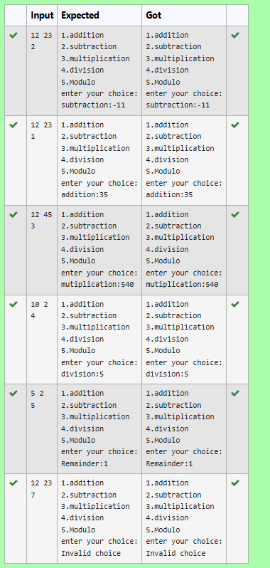

### 🧾 Menu-Driven Arithmetic Operations Using typedef in C
## 🎯 AIM
To construct a menu-based program using typedef in C that performs basic arithmetic operations (addition, subtraction, multiplication, division, and modulo).

## 📚 THEORY
In C, typedef is used to create user-defined names (aliases) for existing data types.

This improves readability and helps in managing complex data types more easily.

This program demonstrates the use of typedef by aliasing int as Arithmetic and then using it for arithmetic operations.

## 🔁 ALGORITHM
Define a custom type using typedef for integers.

Read two integers from the user.

Display a menu for arithmetic operations.

Based on user choice, perform the corresponding operation:

Addition

Subtraction

Multiplication

Division (with zero-check)

Modulo (with zero-check)

Print the result of the operation.

## 🧾 TYPEDEF DEFINITION
```
typedef int Arithmetic;
```

## 🖥️ PROGRAM
```
#include <stdio.h>

// Define a custom type for arithmetic operations
typedef int Arithmetic;

int main() {
    Arithmetic num1, num2, result;
    int choice;

    scanf("%d %d", &num1, &num2);

    printf("1.addition\n");
    printf("2.subtraction\n");
    printf("3.multiplication\n");
    printf("4.division\n");
    printf("5.Modulo\n");
    printf("enter your choice:");
    scanf("%d", &choice);

    // Perform operation based on choice
    switch (choice) {
        case 1:
            result = num1 + num2;
            printf("\naddition:%d", result);
            break;
        
        case 2:
            result = num1 - num2;
            printf("\nsubtraction:%d", result);
            break;
        
        case 3:
            result = num1 * num2;
            printf("\nmutiplication:%d", result);
            break;
        
        case 4:
            if (num2 != 0) {
                float div_result = (float)num1 / num2;
                printf("\ndivision:%.0f", div_result);
            } else {
                printf("\nError! Division by zero.");
            }
            break;
        
        case 5:
            if (num2 != 0) {
                result = num1 % num2;
                printf("\nRemainder:%d", result);
            } else {
                printf("\nError! Modulo by zero.");
            }
            break;

        default:
            printf("\nInvalid choice");
    }

    return 0;
}

```

## 📤 Output:



## ✅ RESULT
Thus, the menu-driven C program for arithmetic operations using typedef has been successfully executed.

