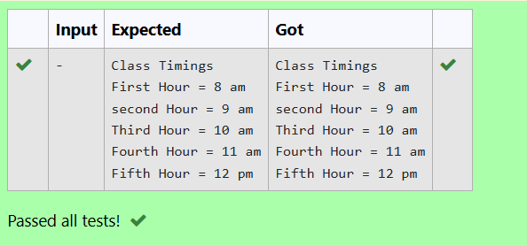

### 🕗 Class Timings Display Using Enumeration in C
## 🎯 AIM
To write a C program that uses an enumeration (enum) to represent class hour timings and prints the schedule from the first hour to the fifth hour.

## 📚 THEORY
🔹 What is enum in C?
An enumeration is a user-defined data type in C that consists of integral constants, making code more readable and maintainable.

```
enum example {VAL1 = 10, VAL2, VAL3};
Here, VAL1 = 10, VAL2 = 11, and VAL3 = 12 (auto-incremented).
```

## 💡 APPLICATION
In this program:

We define an enum ti for class hours, starting from 8 am.

Each successive hour auto-increments by 1.

We then print the time for each class period.

## 🔁 ALGORITHM
Define an enumeration ti with members: first = 8, second, third, fourth, fifth.

In the main() function, print each hour using the enumeration constants.

Format output to include "am" or "pm" as appropriate.

## 🖥️ PROGRAM
```
#include<stdio.h>
enum ti{
    first=8,second,third,fourth,fifth
};
int main(){
    printf("Class Timings\nFirst Hour = %d am\nsecond Hour = %d am\nThird Hour = %d am\nFourth Hour = %d am\nFifth Hour = %d pm",
    first,second,third,fourth,fifth);
    
}
```


## 🧪 SAMPLE OUTPUT

## ✅ RESULT
The C program using enum to display class hour timings from 8 am to 12 pm was implemented and executed successfully.