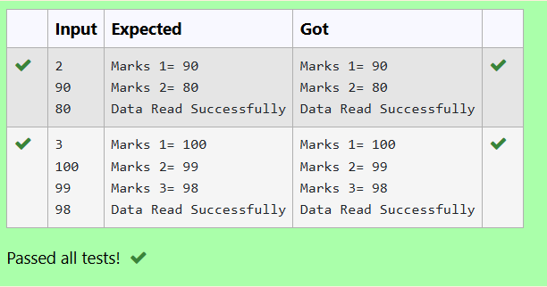

### 🧾 File Handling in C — Writing and Reading Marks from a File
## 🎯 AIM
To write a C program that:

Creates a file named marks.txt

Writes marks to the file

Reads the marks from the file and displays them

## 📚 THEORY
File handling in C allows a program to read and write data to files stored on the disk.
The standard functions used are:

fopen() – opens a file

fprintf() – writes formatted output to a file

fscanf() – reads formatted input from a file

fclose() – closes the file

This program demonstrates:

Writing integer values (marks) to a file

Reading them back and displaying them to the user

## 🔁 ALGORITHM
Open the file marks.txt in write mode using fopen("marks.txt", "w").

If the file cannot be created, display an error and exit.

Read the number of marks n from the user.

Loop n times to get each mark and write it to the file using fprintf().

Close the file.

Reopen the file in read mode using fopen("marks.txt", "r").

Read the marks using fscanf() and display each one.

Close the file and print a success message.

## 🖥️ PROGRAM
```
#include <stdio.h>

int main() {
    FILE *file;
    int n, marks, i;
    file = fopen("marks.txt", "w");

    if (file == NULL) {
        printf("Error: Unable to create file.\n");
        return 1;
    }

        scanf("%d", &n);
    for (i = 0; i < n; i++) {
        scanf("%d", &marks);
        fprintf(file, "%d\n", marks);
    }
    fclose(file);

    file = fopen("marks.txt", "r");

    if (file == NULL) {
        printf("Error: Unable to open file for reading.\n");
        return 1;
    }

    for (i = 0; i < n; i++) {
        fscanf(file, "%d", &marks);
        printf("Marks %d= %d\n", i + 1, marks);
    }

    printf("Data Read Successfully\n");

    fclose(file);

    return 0;
}
```

## 🧪 SAMPLE INPUT / OUTPUT



## ✅ RESULT
The C program to write marks to a file and read them back using file handling operations was executed successfully.